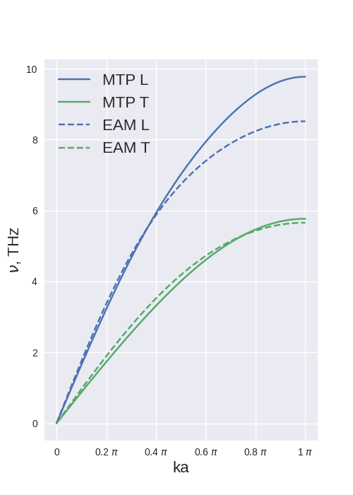

В качестве объекта исследования фононного спектра был выбран алюминий. Были использованы два различных потенциала: EAM (Zhou Al Acta mater(2001)49:4005) и mtp, обученный самостоятельно из курса прошлого семестра.

Силовые постоянные в зависимости от атомной плоскости | График фононного спектра
|---|---|
|  |  |