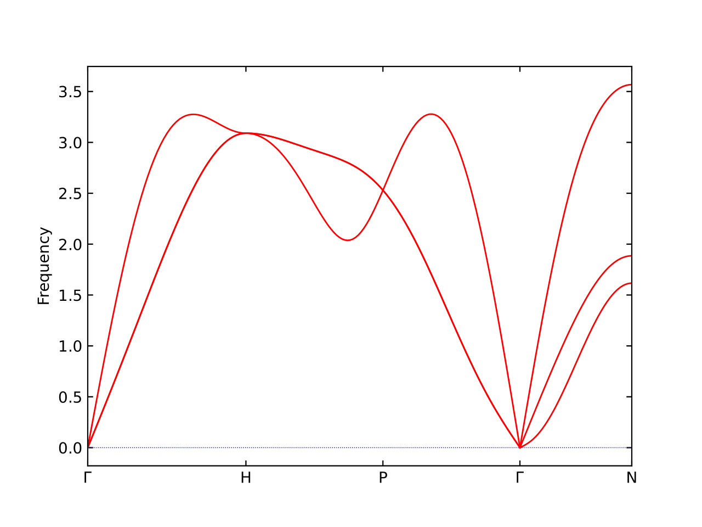
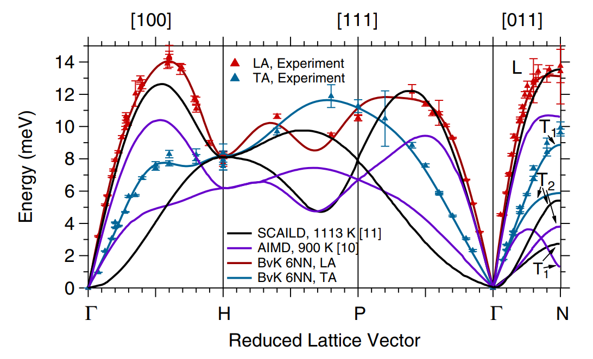
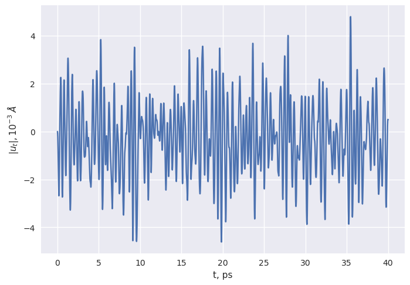
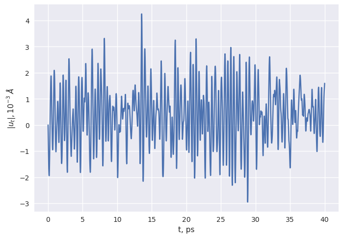
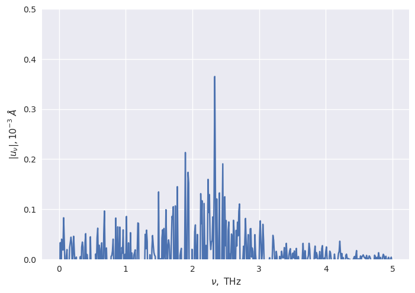
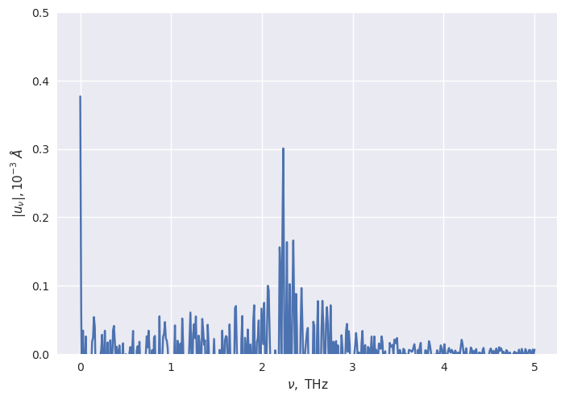
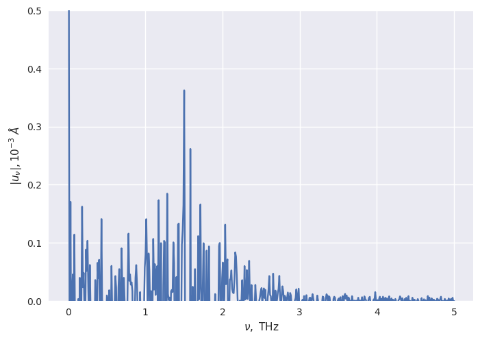
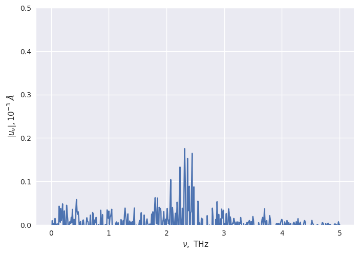
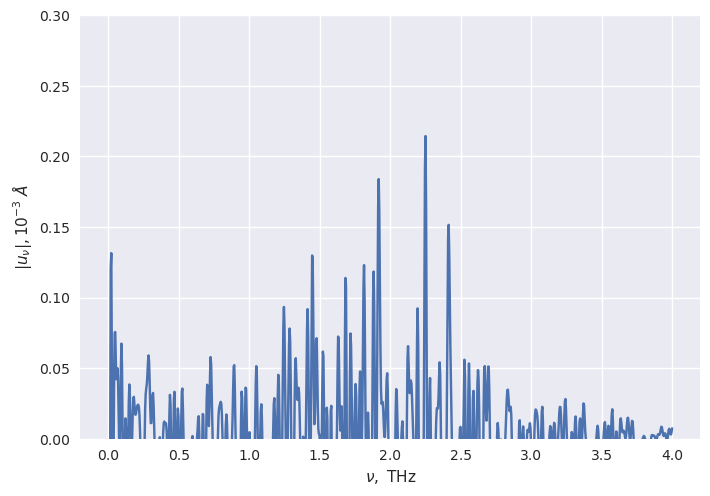
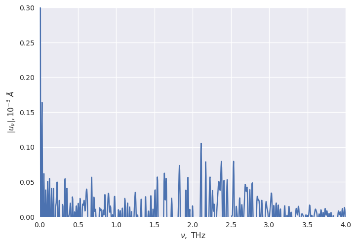

# Предварительный расчёт спектра

Первым делом был посчитан весь спектр предварительно отрелаксированного $\gamma$-U в гармоническом приближении (при нулевой температуре) через phonopy:


Частота выражена в THz


Что действительно описывает спектр ОЦК решетки. Однако по значениям из статьи:



Это довольно далеко от правды, поскольку 1 THz это примерно 4 meV. Поэтому в первой точке на границе зоны Бриллюэна значение частоты - около 2 THz, в то время как phonopy предсказал 3 THz.

# Определение ширины спектральных линий в точка высокой симметрии

## Постановка задачи MD
Эмпирическим путем было выяснено, что ядро jupyter notebook при последующей обработке не падает с ячейкой $18a \times 18 a \times 18 a $, где $a$ - период решётки. Поэтому расчёт происходил при 11664 атомах.

- Длительность расчёта: 40 ps
- Шаг печати конфигураций: 10 fs
- Шаг интегрирования: 2 fs

Предварительно перед началом расчёта ячейка была отрелаксирована в NPT ансамбле при 900К и атмосферном давлении в течении 5 ps.

В качестве потенциала был взят

```
EAM potential for uranium in LAMMPS setfl format
Smirnova D.E., Starikov S.V., Stegailov V.V. [see J. Phys.: Cond. Mat. 24 (2012) 015702]
produced using VASP and PotFit
```

который, как удтверждалось авторами способен предсказывать свойства урана при высоких температурах и при разных фазах, в том числе $\gamma$-U.

## Обработка результатов

### T = 900 K

##### Точка H

| Transverse | Longitudinal |
| ---------- | ------------ |
|  | 
|  | 

В какой-то степени данный результат действительно сходится с экспериментом и расчётами из статьи.

##### Точка $\vec{\Gamma} + \frac12 \overrightarrow{\Gamma H}$ (половина расстояния до H)

| Transverse | Longitudinal |
| ---------- | ------------ |
|  | 


Здесь уже расхождение, значение поперечной волны не так плохо ложиться, а для продольный - уже сильный промах, поскольку ожидалось получить частоту около 3 THz.

### T = 300K

##### Точка H
| Transverse | Longitudinal |
| ---------- | ------------ |
|  | 


