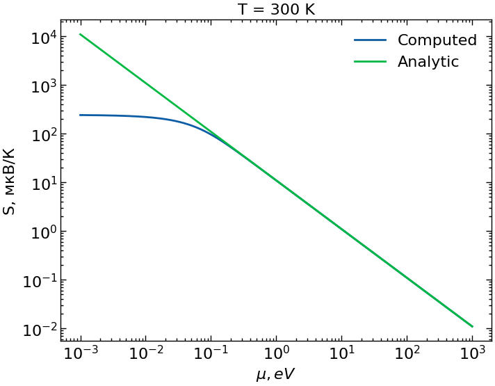

## Вычисление коэффициента Зеебека

Из теории линейного отклика потоки тепла и заряда связаны следующим образом:

$$
\begin{pmatrix} j_e \\ j_Q \end{pmatrix} = \begin{pmatrix} L_{11} & L_{12} \\ L_{21} & L_{22} \end{pmatrix} \begin{pmatrix} \vec{G} \\ -\frac{\nabla T}{T} \end{pmatrix}
$$

где $L_{11} = \sigma$, $S = (L_{11})^{-1} \dfrac{L_{12}}{T}$

$L_{ij}$ - коэффициенты Онзагера, которые могут быть вычислены следующим образом

$$L^{\nu} = e^2 \int \dfrac{d\vec{k}}{4\pi^3} \left(- \dfrac{\partial f}{\partial E}\right) v_{\alpha} v_{\beta} (E - \mu)^{\nu}$$

Преобразовав её к виду

$$L^{\nu} = \dfrac{\tau e ^2}{2 \pi ^2} \int \left(\dfrac{2m}{\hbar^2}\right)^{3/2} \dfrac{e^{\frac{E - \mu}{kT}}}{ e^{\frac{E - \mu}{kT}} + 1} \dfrac{\sqrt{E}}{kT} \left(\dfrac{2E}{m}\right) (E - \mu)^\nu$$

Можем получить следующее значение для коэффициента Зеебека при комнатной температуре

Где теоретическая оценка $S=\dfrac{\pi^2}{2} \dfrac{k^2 T}{e \mu}$

Как можно заметить, достаточно сильные отклонения наблюдаются при низких значениях химпотенциала.